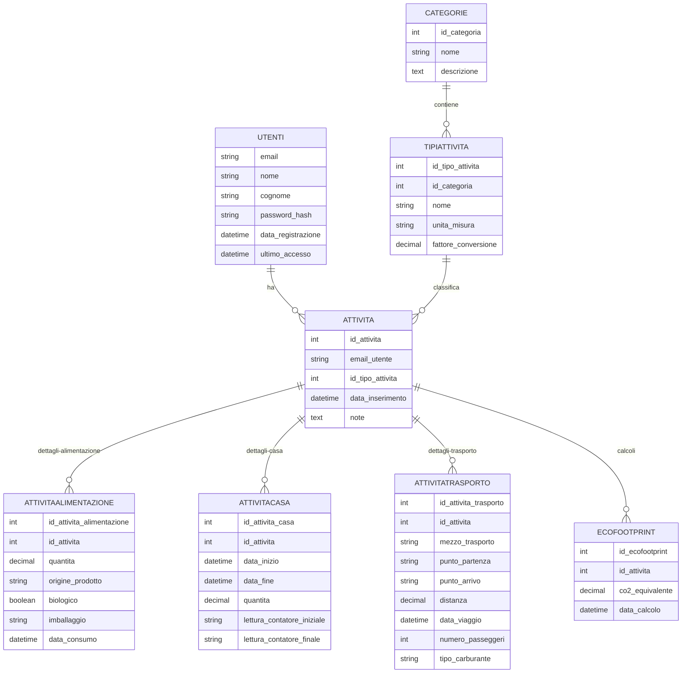

# 🌿 EcoPasso: Cammina Verso un Futuro Sostenibile

**EcoPasso** è l'app che ti aiuta a calcolare, monitorare e ridurre la tua impronta ecologica. Ogni passo conta per rendere il pianeta un posto migliore.  

Con un design intuitivo e strumenti avanzati, EcoPasso ti guida verso uno stile di vita più sostenibile. 🌍✨

---

## 📌 Indice

- [🌍 Cos'è l'Impronta Ecologica](#-cosè-limpronta-ecologica)
- [🎯 Obiettivi del Progetto](#-obiettivi-del-progetto)
- [🌟 Benefici dell'Uso di EcoPasso](#-benefici-delluso-di-ecopasso)
- [🧑‍💻 Tecnologie Utilizzate](#-tecnologie-utilizzate)
- [📱 Interfaccia Utente](#-interfaccia-utente)
- [📊 Schema del Database](#-schema-del-database)
- [⚙️ Esempi di Codice](#️-esempi-di-codice)
- [🚀 Come Avviare EcoPasso](#-come-avviare-ecopasso)
- [📽️ Video Dimostrativo](#️-video-dimostrativo)

---

## 🌍 Cos'è l'Impronta Ecologica

L'**impronta ecologica** è un indicatore globale che misura il consumo umano di risorse naturali rispetto alla capacità del pianeta di rigenerarle.  
Viene calcolata considerando diversi aspetti dell'impatto umano sull'ambiente, tra cui:

- **Emissioni di gas serra (CO2):** Derivanti da trasporti, produzione di energia, riscaldamento e altre attività.
- **Consumo di risorse naturali:** Come acqua, cibo, materiali e combustibili fossili.
- **Produzione di rifiuti:** Inclusi rifiuti non riciclabili e pericolosi.
- **Uso del suolo:** Per agricoltura, urbanizzazione e deforestazione.

### Tipi di Impronta Ecologica

1. **Impronta di carbonio:** Misura le emissioni di CO2 generate da attività quotidiane.
2. **Impronta idrica:** Indica il consumo di acqua dolce.
3. **Impronta dei materiali:** Si riferisce all'uso di risorse come metalli, plastica e legname.
4. **Impronta alimentare:** Analizza l'impatto della produzione e del consumo di cibo.

### Perché è importante monitorare l'impronta ecologica?

- **Prevenire il sovrasfruttamento:** Il pianeta ha risorse limitate e il sovraconsumo porta a conseguenze irreversibili, come cambiamenti climatici e perdita di biodiversità.
- **Aumentare la consapevolezza:** Sapere dove e come possiamo ridurre il nostro impatto è il primo passo verso un cambiamento positivo.
- **Promuovere uno stile di vita sostenibile:** Piccole azioni quotidiane, come ridurre gli sprechi o scegliere fonti di energia rinnovabile, fanno una grande differenza.
- **Garantire un futuro migliore:** Per noi e per le prossime generazioni.

Con **EcoPasso**, monitorare l'impronta ecologica diventa semplice e accessibile a tutti. 🌿

---

## 🎯 Obiettivi del Progetto

**EcoPasso** è stato progettato con una missione chiara: aiutarti a vivere in modo più responsabile e sostenibile. I principali obiettivi includono:

1. **Educazione Ambientale:**
   - Sensibilizzare gli utenti sull'importanza della sostenibilità.
   - Fornire informazioni dettagliate sull'impatto ambientale delle loro azioni.

2. **Monitoraggio e Analisi:**
   - Offrire strumenti per monitorare l'impronta ecologica personale.
   - Visualizzare i progressi con grafici e report chiari e intuitivi.

3. **Promozione di Azioni Concrete:**
   - Suggerire abitudini sostenibili, come ridurre gli sprechi di energia o scegliere mezzi di trasporto ecologici.
   - Premiare i progressi con badge o notifiche motivazionali.

4. **Creazione di una Comunità:**
   - Connettere gli utenti in una rete globale per condividere consigli e ispirazione.
   - Favorire il cambiamento collettivo attraverso la collaborazione.

5. **Supporto alle Politiche Ambientali:**
   - Offrire dati aggregati per supportare iniziative e politiche di sostenibilità.
   - Collaborare con enti locali e globali per promuovere uno sviluppo sostenibile.

---

## 🌟 Benefici dell'Uso di EcoPasso

### Per gli Utenti:

- **Consapevolezza:** Impara a conoscere il tuo impatto ambientale e come ridurlo.
- **Risparmio:** Riduci gli sprechi di energia, acqua e risorse, risparmiando anche denaro.
- **Motivazione:** Raggiungi obiettivi personali e condividi i tuoi successi con la comunità.

### Per il Pianeta:

- **Riduzione delle emissioni:** Promuovendo scelte più ecologiche.
- **Conservazione delle risorse:** Favorendo un uso più responsabile di acqua, energia e materiali.
- **Protezione della biodiversità:** Riducendo l'impatto delle attività umane sull'ambiente naturale.

### Per la Società:

- **Educazione collettiva:** Diffondere conoscenze e buone pratiche.
- **Sviluppo sostenibile:** Supportare comunità e aziende verso un futuro green.
- **Impatto positivo:** Ogni piccolo passo contribuisce a un cambiamento globale.

---

## 🧑‍💻 Tecnologie Utilizzate

### Frontend (Client)

- **Linguaggio:** JavaScript
- **Framework:** [React Native](https://reactnative.dev/) con [Expo](https://expo.dev/)
- **Funzionalità:**
  - Interfaccia moderna e user-friendly.
  - Navigazione fluida e intuitiva.
  - Visualizzazioni grafiche accattivanti dei tuoi progressi.

### Backend (Server)

- **Linguaggio:** Java
- **Framework:** [Spring Boot](https://spring.io/projects/spring-boot)
- **Funzionalità:**
  - API RESTful per comunicazione veloce e sicura.
  - Autenticazione avanzata.
  - Calcolo dinamico dell'impronta ecologica.

### Database

- **Sistema:** [MySQL](https://www.mysql.com/)
- **Struttura:**
  - Tabelle ben organizzate per utenti, attività e calcoli ambientali.

---

## 📱 Interfaccia Utente


*Benvenuto nella tua dashboard personalizzata.*


*Inserisci i tuoi dati per calcolare l'impatto.*


*Visualizza i tuoi progressi e ricevi consigli utili.*

---

## 📊 Schema del Database

Ecco uno schema visivo del database che alimenta **EcoPasso**:



---

## ⚙️ Esempi di Codice

### Frontend (React Native)

```javascript
// Esempio di fetch dei dati dell'impronta ecologica
useEffect(() => {
  fetch('https://api.ecopasso.com/user/footprint')
    .then(response => response.json())
    .then(data => setFootprint(data));
}, []);
```

### Backend (Spring Boot)

```java
// Endpoint per ottenere l'impronta ecologica dell'utente
@GetMapping("/user/footprint")
public ResponseEntity<Footprint> getUserFootprint(@RequestParam Long userId) {
    Footprint footprint = footprintService.calculate(userId);
    return ResponseEntity.ok(footprint);
}
```

---

## 🚀 Come Avviare EcoPasso

### Prerequisiti

- [Node.js](https://nodejs.org/) installato.
- [Expo CLI](https://docs.expo.dev/get-started/installation/) installato globalmente.
- [Java JDK](https://www.oracle.com/java/technologies/javase-downloads.html) installato.
- [MySQL](https://www.mysql.com/) installato e configurato.

### Avvio del Client

```bash
cd client
npm install
npx expo start
```

### Avvio del Server

```bash
cd server
./mvnw spring-boot:run
```

---

## 📽️ Video Dimostrativo

Scopri come funziona **EcoPasso** con il nostro video dimostrativo:

[](https://www.youtube.com/watch?v=tuo_video_id)

---
